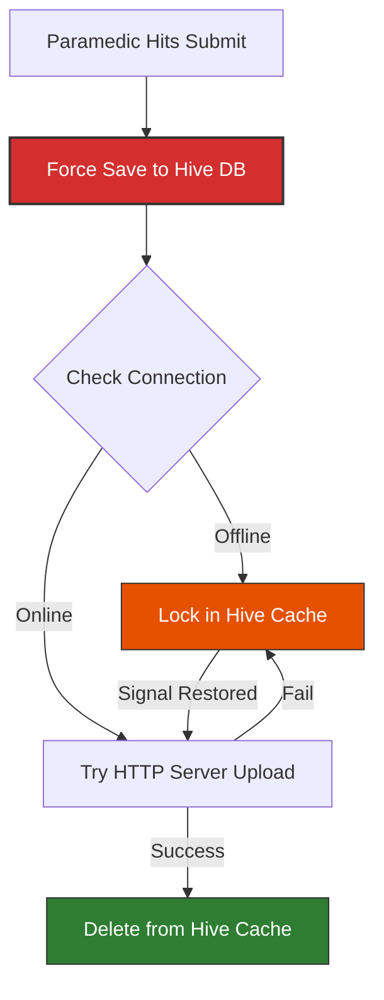

# offline-ems-triage-flutter

A resilient, high-visibility Paramedic Triage Intake Application built with Flutter and Dart. Designed specifically for Emergency Medical Services (EMS) operating in high-stress, low-connectivity, or zero-network environments.

---

## 🛠️ Tech Stack

* **Framework:** Flutter (Dart)
* **Local Persistence:** Hive (Ultra-fast, lightweight NoSQL key-value storage)
* **State Management:** Riverpod (Decoupled, predictable state notifications)
* **Network Monitoring:** Connectivity Plus

---

## 🏗️ Architecture & Design

The app is built to be fast, predictable, and simple to navigate under pressure, strictly separating the user interface from the background sync engine.

### 1. Decoupled Layers
* **UI Layer (`lib/screens/`):** Completely stateless and lightweight. It watches data streams and stays zero-lag so the app never freezes while typing.
* **State Controller (`lib/providers/`):** The brain of the app. It watches for network changes, handles form state, and kicks off the upload queue when a connection returns.
* **Data Repository (`lib/repositories/`):** The data mover. It handles writing directly to local Hive storage and manages the simulated API upload loops.

### 2. High-Visibility UX Design
Paramedics operate under extreme visual and mental fatigue. The interface is optimized to minimize mistakes:
* **Single-Screen Focus:** The layout fits entirely on one screen with large tap targets for quick, single-thumb entry under pressure.
* **Hazard Color-Coding:** Marking a patient as **Priority 1 or 2** instantly triggers high-visibility reds and oranges across borders and buttons to reinforce situational awareness.

---

### 🛰️ How the Sync Engine Works

We don’t trust shaky cellular signals when a patient’s life is on the line. The app runs on a simple, strict workflow: **save locally first, upload second**.



* **Instant Safety Net:** The millisecond a paramedic hits submit, data goes straight to local Hive storage. No loading spinners, no waiting on a network handshake.
* **Smart Server Uploads:** If the device has a connection, it immediately attempts to push the record to the backend. On success, it deletes the local copy.
* **Zero-Effort Auto-Sync:** A background listener constantly watches connection status. The exact second the device catches a signal, the engine wakes up and flushes cached records sequentially without freezing the screen.

## 📂 File Layout

```text
lib/
├── main.dart                  # App entry point + Hive initialization
├── models/
│   ├── triage_model.dart      # Data schema & serialization properties
│   └── triage_model.g.dart    # Generated Hive TypeAdapter
├── repositories/
│   └── triage_repository.dart # Direct Hive disk operations & simulated API client
├── providers/
│   └── triage_provider.dart   # Riverpod state notifier & connectivity observer
└── screens/
    └── triage_form_screen.dart# High-visibility form UI & situational color-coding

test/
├── models/
│   └── triage_model_test.dart # Schema validation & JSON mapping unit tests
└── providers/
    └── triage_notifier_test.dart # Cache enforcement & sync queue state tests
```
## 🚀 Getting It Running Locally

Getting the application up and running on your machine only takes a minute:

### Prerequisites
* You will need the **Flutter SDK** installed (anything above version `3.10.0` works perfectly).
* An open mobile **emulator/simulator** or a real phone plugged into your computer with debugging enabled.

### Quick Start Commands
Open your terminal and run these commands:

```bash
# 1. Grab the repository code
git clone [https://github.com/YOUR_USERNAME/offline-ems-triage-flutter.git](https://github.com/YOUR_USERNAME/offline-ems-triage-flutter.git)
cd offline-ems-triage-flutter


# 2. Pull down all external packages
flutter pub get

# 3. Launch the application on your device
flutter run

# 4. Run the test suite to verify code logic
flutter test
```

## 🧪 Testing the Sync

## 📺 Demo Video

[](https://youtube.com/shorts/JM7h2V85gPk?si=DOxtt1fzvCesPz9D)
### Scenario A: Go Offline
1. Turn on **Airplane Mode** (badge changes to red **OFFLINE**).
2. Fill out the form, set **Priority 1**, and tap **SUBMIT INTAKE**.
> **Result:** The UI remains completely responsive. A yellow alert banner appears showing `1 form waiting sync`.

### Scenario B: Reconnect
1. Turn **Airplane Mode OFF**.
> **Result:** The badge changes to green **ONLINE**. The background engine automatically flushes the queue, uploads pending records, and clears the alert banner without requiring a manual refresh.

### Scenario C: App Crash Recovery
1. Turn on **Airplane Mode** (badge changes to red **OFFLINE**).
2. Fill out a triage form and tap **SUBMIT INTAKE**.
3. Force close / kill the application entirely from your device's recent apps switcher.
4. Turn **Airplane Mode OFF**.
5. Re-open the application.
> **Result:** On app cold boot, the initialization logic checks the local storage. The Riverpod provider immediately identifies the cached Hive entry and flushes it to the server without requiring any user interaction or form re-entry.